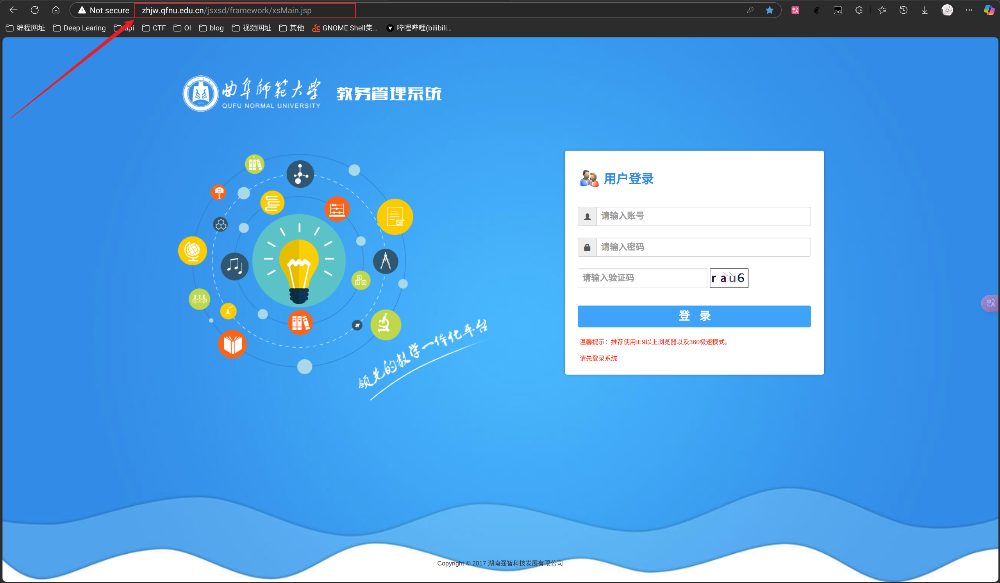
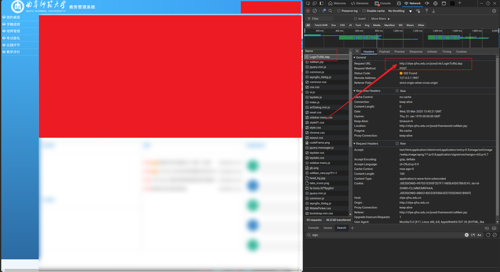
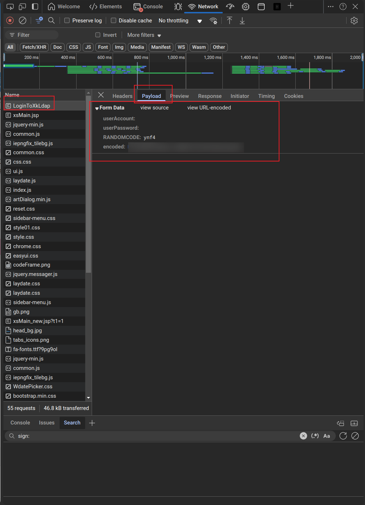

# QFNU_Login
强智系统登陆 | python | QFNU | 教务系统

# 讲解

> [!NOTE]
> 强智系统使用的JSESSIONID来作为cookie。

JESSIONID的生成是由服务器端生成的，所以无法自己进行伪造。

但是JESSIONID的获取并不困难，只需要使用`python`的`requests.session()`来进行持续化的链接来存储JESSIONID即可。

> [!WARNING]
> `session()`要获取到JESSIONID，必须按序访问网站，否则JESSIONID获取不全。

然后进行分析登录的页面，进行登录即可。

